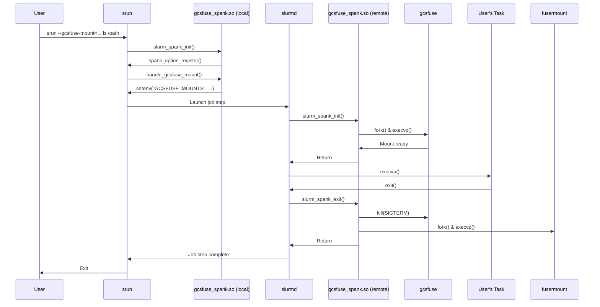

# Slurm SPANK plugin for GCSFuse

This project provides a Slurm SPANK plugin that allows users to manage
gcsfuse mounts through srun commands.

## Interface

The desired interface is:
`--gcsfuse-mount=BUCKET_NAME:MOUNT_POINT[:FLAGS]`

This will start gcsfuse on all nodes at the beginning of the step, and will
unmount the bucket at the end.

## Design

The plugin uses the Slurm SPANK plugin infrastructure to mount GCS buckets
at the beginning of a job step and unmount them at the end.

The plugin operates in two contexts:

1.  **Local (srun) context:** When the user runs `srun` with the
    `--gcsfuse-mount` option, the `handle_gcsfuse_mount` callback function
    is invoked. This function resolves any relative paths in the mount
    point and then appends the mount specification to the `GCSFUSE_MOUNTS`
    environment variable. This environment variable is then passed to the
    remote context.

2.  **Remote (slurmd) context:** On the compute node, the `slurm_spank_init`
    function is called. This function reads the `GCSFUSE_MOUNTS` environment
    variable, parses the mount specifications, and then forks a new process
    to execute the `gcsfuse` command for each mount. The plugin then waits
    for the mount to become ready by checking the output of the `mountpoint`
    command.

At the end of the job step, the `slurm_spank_exit` function is called in the
remote context. This function is responsible for unmounting the gcsfuse
filesystems by forking a new process to execute the `fusermount -u` command.

## Functionality

This plugin allows users to easily mount GCS buckets within their Slurm jobs.
The `--gcsfuse-mount` option can be used multiple times to mount multiple
buckets.

**Error Handling:** If multiple mounts are specified, the plugin attempts to set up
each one. If any mount fails (e.g., bucket not found, permission error,
mount point issue), an error is logged, but the plugin will continue to
attempt to set up the remaining mounts. The `srun` command will return a non-zero
exit code if any mount failed, but the job step will still execute with any
successfully established mounts.

### Examples

1.  **Mount a bucket and list its contents:**
    ```bash
    srun --gcsfuse-mount=my-bucket:/tmp/my_bucket ls /tmp/my_bucket
    ```

2.  **Mount a bucket with gcsfuse flags (e.g., read-only and implicit directories):**
    ```bash
    srun --gcsfuse-mount=my-bucket:/tmp/my_bucket:"-o ro --implicit-dirs" ls /tmp/my_bucket
    ```

3.  **Mount a specific directory within a bucket:**
    ```bash
    srun --gcsfuse-mount=my-bucket:/tmp/my_dir:"--only-dir my_folder" ls /tmp/my_dir
    ```

4.  **Mount a bucket to a relative path:**
    ```bash
    srun --gcsfuse-mount=my-bucket:./my_bucket ls ./my_bucket
    ```

5.  **Mount multiple buckets simultaneously:**
    ```bash
    srun --gcsfuse-mount=bucket-a:/tmp/a --gcsfuse-mount=bucket-b:./b ls /tmp/a ./b
    ```

## Testing

The `files/test_gcsfuse_spank.sh` script can be used to test the plugin
functionality. Please note that this script requires three GCS buckets
(named `your-bucket-a`, `your-bucket-b`, and `your-bucket-c` by default)
to exist and be accessible by the compute node service account. You may need
to create these buckets and/or adjust the bucket names in the script.

## Resource Usage

Each gcsfuse mount runs as a separate process. Users should be aware that
launching a large number of gcsfuse mounts within a single job step will
consume additional memory and CPU resources on the compute node. The exact
overhead per mount depends on the gcsfuse version and the workload, but it's
generally advisable to keep the number of concurrent mounts reasonable.

## Sequence Diagram


